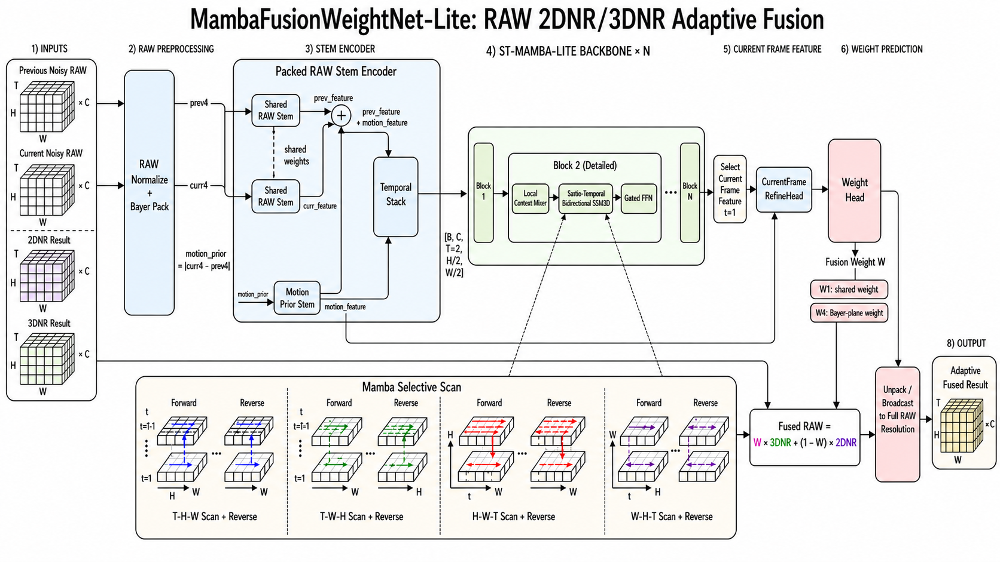

# MambaFusionWeightNet-Lite

轻量级 RAW 域 2DNR/3DNR 自适应融合权重网络。模型读取相邻两帧 noisy RAW，在 Bayer packed 分辨率下构建运动先验，通过 ST-Mamba-Lite 主干建模时空上下文，最终预测当前帧的融合权重图：

```text
prediction = weight * dnr3 + (1 - weight) * dnr2
```

其中 `weight` 越接近 1，输出越偏向 3DNR；越接近 0，输出越偏向 2DNR。默认配置为 `channels=24`、`num_blocks=2`、`weight_mode=w4`，实测参数量为 `101,504`。

## 特性亮点

- RAW-first：输入始终在 Bayer RAW 域内处理，不把单通道 RAW 当作普通灰度图。
- Bayer pack：`[H, W] -> [4, H/2, W/2]`，plane 顺序固定为 `[R, G1, G2, B]`。
- 显式运动先验：`motion_prior = abs(curr4 - prev4)`。
- 轻量 ST-Mamba：4 条时空扫描路径，正反向共 8 个方向，并通过 softmax 可学习融合各方向输出。
- 当前帧锚定：主干输出后仅取 `t=1` 的当前帧特征来预测当前帧权重。
- 两种权重模式：`w1` 为所有 Bayer 位置共享一个权重，`w4` 为 4 个 Bayer plane 分别预测权重。
- 可训练完整 pipeline：包含 H5 数据加载、train/val/test 划分、AMP、checkpoint、JSONL 日志、验证指标和 hard sampling 支持。

## 模型架构



## 仓库结构

```text
MyNet/ai_fusion/
|-- train.py                         # 训练 CLI 入口
|-- evaluate.py                      # 评估 CLI 入口
|-- requirements.txt                 # Python 依赖
|-- raw_utils.py                     # 重新导出 MyNet.data_prepare.raw_utils
|-- dataset_h5.py                    # 重新导出 MyNet.data_prepare.dataset_h5
|-- models/
|   |-- mamba_fusion_weight_net.py   # 顶层模型、refine head、weight head
|   |-- stems.py                     # SharedRawStem、MotionPriorStem
|   |-- stmamba_config.py            # ST-Mamba 配置 dataclass
|   |-- stmamba_layers.py            # LocalContextMixer、STB scan、GatedFFN
|   |-- stmamba_block.py             # 单个 ST-Mamba-Lite block
|   |-- stmamba_stack.py             # 多层主干堆叠
|   `-- mamba_scan.py                # reference / mamba-ssm selective scan
`-- training/
    |-- cli.py                       # 训练参数解析与总控
    |-- data.py                      # 数据划分发现、DataLoader、hard sampling
    |-- engine.py                    # train、validate、dry-run 循环
    |-- losses.py                    # Charbonnier、TV、oracle、entropy loss
    |-- metrics.py                   # PSNR、SSIM、SNR、运动区域指标
    |-- optim.py                     # 模型构建、AdamW 参数组、学习率调度
    `-- persistence.py               # checkpoint 与 JSON/JSONL 日志
```

## 安装

请在仓库根目录执行命令，以便 `MyNet` 能按包方式导入。

```bash
pip install -r MyNet/ai_fusion/requirements.txt
```

核心依赖：

- Python >= 3.10
- `numpy`
- `h5py`
- `torch`

可选依赖：

- `mamba-ssm`：启用 fused CUDA selective scan 后端。

模型代码支持三种 scan backend：

| 后端 | 行为 |
| --- | --- |
| `reference` | 纯 PyTorch 参考实现，兼容性最好，但速度较慢。 |
| `auto` | 在 CUDA 且已安装 `mamba-ssm` 时使用 fused 内核，否则回退到 reference。 |
| `mamba_ssm` | 强制要求 CUDA tensor 和 `mamba-ssm` 包，否则直接报错。 |

训练和评估 CLI 默认使用 `--mamba-scan-backend mamba_ssm`，因此在未安装 fused kernel 时，请改用 `--mamba-scan-backend auto` 或 `reference`。

## 数据集格式

训练代码期望 H5 根目录按 scene 组织：

```text
H5/
├── scene_1/
│   ├── metadata.json
│   ├── shard_000.h5
│   └── ...
├── scene_2/
│   ├── metadata.json
│   └── ...
└── ...
```

每个 scene 都必须包含一个带 `shards` 列表的 `metadata.json`。每个 shard 至少应包含以下字段：

```json
{
  "file": "shard_000.h5",
  "global_start_idx": 0,
  "num_frames": 100,
  "shard_id": 0
}
```

每个 H5 shard 需要包含以下数据集：

| 数据集 | 单样本形状 | 含义 |
| --- | --- | --- |
| `noisy` | `[2, H, W]` | `[上一帧, 当前帧]` 的 noisy RAW 对 |
| `2dnr` | `[H, W]` | 当前帧的 2DNR 结果 |
| `3dnr` | `[H, W]` | 当前帧的 3DNR 结果 |
| `clean` | `[H, W]` | 干净 RAW 目标 |

默认情况下，`H5FusionDataset` 会按以下方式将 `noisy`、`2dnr`、`3dnr` 和 `clean` 归一化到 `[0, 1]`：

```text
(raw - black_level) / (white_level - black_level)
black_level = 16
white_level = 4095
```

同时还会返回预计算好的 packed tensor：

- `prev4`：`[4, H/2, W/2]`
- `curr4`：`[4, H/2, W/2]`
- `motion_prior`：`[4, H/2, W/2]`

为保证 CFA phase 不变，裁剪尺寸和裁剪起点都会被强制为偶数坐标。

### 数据划分规则

`training.data.discover_split_shards` 会按照 shard 顺序对每个 scene 划分：

- `train`：除最后两个 shard 外的全部 shard
- `val`：倒数第二个 shard
- `test`：最后一个 shard

因此每个 scene 至少需要 3 个 shard。

## 快速开始

### Dry Run

建议先运行 dry run，验证数据集、模型形状、loss、AMP 和反向传播链路是否正常。

```bash
python -m MyNet.ai_fusion.train \
  --data-root H5 \
  --output-dir results/ai_fusion_stage0 \
  --mamba-scan-backend auto \
  --dry-run
```

### 训练

```bash
python -m MyNet.ai_fusion.train \
  --data-root H5 \
  --output-dir results/ai_fusion_stage0 \
  --crop-size 256 \
  --batch-size 4 \
  --epochs 5 \
  --max-steps 2000 \
  --weight-mode w4 \
  --channels 24 \
  --num-blocks 2 \
  --mamba-scan-backend auto
```

只训练指定 scene：

```bash
python -m MyNet.ai_fusion.train \
  --data-root H5 \
  --scenes 1 2 scene_3 \
  --output-dir results/ai_fusion_stage0 \
  --mamba-scan-backend auto
```

从完整训练 checkpoint 恢复：

```bash
python -m MyNet.ai_fusion.train \
  --data-root H5 \
  --output-dir results/ai_fusion_stage0 \
  --resume results/ai_fusion_stage0/last.pt \
  --mamba-scan-backend auto
```

仅从模型权重初始化，并重置优化器和调度器：

```bash
python -m MyNet.ai_fusion.train \
  --data-root H5 \
  --output-dir results/ai_fusion_finetune \
  --init-from results/ai_fusion_stage0/best.pt \
  --mamba-scan-backend auto
```

### 评估

```bash
python -m MyNet.ai_fusion.evaluate \
  --data-root H5 \
  --checkpoint results/ai_fusion_stage0/best.pt \
  --split test \
  --crop-size 384 \
  --batch-size 2 \
  --mamba-scan-backend auto
```

使用 `--crop-size 0` 可进行整帧评估。

## Python API

### 原始 RAW 对前向

`forward()` 接收原始 RAW 数值范围下的全分辨率输入，并在内部完成归一化和 Bayer pack。

```python
import torch
from MyNet.ai_fusion.models import MambaFusionWeightNetLite

model = MambaFusionWeightNetLite().eval()

noisy_pair = torch.rand(1, 2, 256, 256) * 4095.0
dnr2 = torch.rand(1, 256, 256)
dnr3 = torch.rand(1, 256, 256)

with torch.no_grad():
    output = model(noisy_pair, dnr2=dnr2, dnr3=dnr3)

print(output.weight.shape)        # [1, 1, 256, 256]
print(output.packed_weight.shape) # weight_mode="w4" 时为 [1, 4, 128, 128]
print(output.prediction.shape)    # [1, 256, 256]
```

### Packed 前向

训练时使用 `forward_packed()`，因为数据集已经返回了归一化后的 packed tensor。

```python
output = model.forward_packed(
    prev4=batch["prev4"],
    curr4=batch["curr4"],
    motion_prior=batch["motion_prior"],
    dnr2=batch["dnr2"],
    dnr3=batch["dnr3"],
)
```

不要把 `H5FusionDataset` 中已经归一化的 `noisy_pair` 再传给 `forward()`，否则会被二次归一化。

### 自定义配置

```python
from MyNet.ai_fusion.models import (
    MambaFusionWeightNetLite,
    MambaFusionWeightNetLiteConfig,
    STMambaLiteConfig,
    StemConfig,
)

config = MambaFusionWeightNetLiteConfig(
    stem_config=StemConfig(stem_channels=32),
    backbone_config=STMambaLiteConfig(
        channels=32,
        num_blocks=3,
        mamba_state_dim=8,
        mamba_expand=2,
        mamba_scan_backend="auto",
    ),
    weight_mode="w4",
    cfa_pattern="GBRG",
    weight_bias_init=0.0,
)

model = MambaFusionWeightNetLite(config)
```

## 模型细节

### RAW 预处理

`prepare_noisy_pair_features` 会执行三步：

1. 将上一帧和当前帧 RAW 归一化到 `[0, 1]`。
2. 将每一帧 Bayer-pack 成 `[R, G1, G2, B]`。
3. 构建 `motion_prior = abs(curr4 - prev4)`。

支持的 CFA 模式：

- `RGGB`
- `BGGR`
- `GBRG`
- `GRBG`

默认值为 `GBRG`。

### Stem 编码器

`PackedRawStemEncoder` 包含：

- `SharedRawStem`：同一个模块实例同时作用于 `prev4` 和 `curr4`。
- `MotionPriorStem`：将 `motion_prior` 编码到相同通道宽度。

两条 stem 采用相同的轻量块结构：

```text
Conv 3x3 -> depthwise Conv 3x3 -> pointwise Conv 1x1 -> activation
```

随后：

```text
prev_with_motion = SharedRawStem(prev4) + MotionPriorStem(motion_prior)
curr_with_motion = SharedRawStem(curr4) + MotionPriorStem(motion_prior)
temporal_stack = stack([prev_with_motion, curr_with_motion], dim=T)
```

### ST-Mamba-Lite 主干

每个 `STMambaLiteBlock` 会执行：

1. 对上一帧和当前帧特征做 `LocalContextMixer`。
2. 在 `[B, C, T=2, H/2, W/2]` 上执行 `SpatioTemporalBidirectionalSSM3D`。
3. 仅对当前帧输出应用 `GatedFFN`。

STB 模块包含四种扫描轴顺序：

```text
T -> H -> W
T -> W -> H
H -> W -> T
W -> H -> T
```

每条路径都包含前向和反向扫描，因此总共有 8 个方向输出。最终 STB 特征为：

```text
mixed = sum(softmax(direction_logits)[i] * path_output[i])
```

当前代码会将 `motion_feature` 传过 stack API 以保持接口形状一致；但实际运动信息是在进入 stack 之前注入一次，并在 `CurrentFrameRefineHead` 中再次注入。

### Selective Scan

`MambaSelectiveScan1D` 处理展平后的 `[B, L, C]` 序列：

```text
Linear -> depthwise causal Conv1d -> dynamic SSM params
       -> selective scan -> gated output -> Linear
```

扫描中使用稳定的状态转移：

```text
A = -exp(A_log)
delta = softplus(dt_proj(...))
```

`scan_backend="auto"` 会在 CUDA 且可用时尝试 fused `mamba-ssm` kernel，否则回退到 PyTorch reference 实现。

### Refine Head 与 Weight Head

经过主干后，仅保留当前帧特征：

```python
current_feature = temporal_stack[:, :, 1]
```

随后 `CurrentFrameRefineHead` 会再次利用运动特征：

```text
concat(current_feature, motion_feature)
  -> 1x1 conv
  -> depthwise 3x3 conv
  -> 1x1 conv
```

`WeightHead` 本质上是一个 `1x1 conv + sigmoid`。其卷积权重初始化为 0，bias 初始化为 `weight_bias_init`，因此初始融合权重大约为：

```text
sigmoid(weight_bias_init)
```

默认 `weight_bias_init=0.0`，对应初始权重 `0.5`。

## 训练目标

`training.losses.compute_loss` 会组合以下损失项：

| 项 | 代码 | 作用 |
| --- | --- | --- |
| 重建损失 | `charbonnier_loss(pred, clean)` | 主要的监督式融合损失。 |
| 边缘感知 TV | `edge_aware_tv_loss(packed_weight, curr4)` | 在平坦区域平滑权重，同时保留边缘。 |
| Plane 一致性 | `plane_consistency_loss(packed_weight)` | 可选的 W4 plane 正则。 |
| Oracle 权重监督 | `oracle_weight_loss` 或 `masked_soft_winner_loss` | 可选的融合权重直接监督。 |
| 熵惩罚 | `diversity_loss(weight)` | 可选项，用于鼓励更明确的权重分配。 |

总损失为：

```text
loss = loss_rec
     + lambda_tv * loss_tv
     + lambda_plane * loss_plane
     + lambda_oracle * loss_oracle
     + lambda_diversity * loss_diversity
```

还可以使用可选的运动加权，在高运动区域提升重建损失权重：

```bash
--motion-weight-alpha 1.0
```

## 指标

验证阶段会输出以下指标：

- `psnr`：融合输出相对 clean 的 PSNR
- `psnr_dnr2`：2DNR 基线相对 clean 的 PSNR
- `psnr_dnr3`：3DNR 基线相对 clean 的 PSNR
- `psnr_gain_dnr2`：融合 PSNR 相比 2DNR 的增益
- `psnr_gain_dnr3`：融合 PSNR 相比 3DNR 的增益
- `snr`：信噪比
- `ssim`：基于 11x11 average-pool 的 SSIM 近似
- `motion_psnr`：高运动像素区域上的融合 PSNR
- `motion_psnr_dnr3`：高运动像素区域上的 3DNR PSNR
- `motion_psnr_gain_dnr3`：高运动区域中融合结果相对 3DNR 的增益
- `weight_mean`、`weight_std`：全分辨率权重统计
- `plane_mean_gap`：W4 权重各 plane 均值的最大最小差

运动 mask 的构造方式为：对每个样本的 `motion_prior.mean(dim=1)` 取前 20% 的高响应区域，再上采样回全分辨率。

模型选择分数为：

```text
score = psnr + 0.5 * motion_psnr_gain_dnr3
```

## 关键 CLI 选项

| 选项 | 默认值 | 说明 |
| --- | --- | --- |
| `--weight-mode` | `w4` | `w1` 共享权重，或 `w4` Bayer-plane 独立权重。 |
| `--channels` | `24` | Stem 和主干的通道宽度。 |
| `--num-blocks` | `2` | ST-Mamba-Lite block 数量。 |
| `--mamba-state-dim` | `8` | Selective scan 状态维度。 |
| `--mamba-expand` | `2` | Mamba 内部通道扩张倍率。 |
| `--mamba-scan-backend` | `mamba_ssm` | `auto`、`reference` 或 `mamba_ssm`。 |
| `--cfa-pattern` | `GBRG` | Bayer CFA 排布。 |
| `--weight-bias-init` | `0.0` | 融合权重的初始 sigmoid bias。 |
| `--crop-size` | `256` | 训练裁剪尺寸，必须为偶数。 |
| `--val-crop-size` | `None` | 默认跟随训练裁剪；设为 `0` 表示整帧验证。 |
| `--max-steps` | `2000` | 最大优化步数；设为 `0` 表示完整 epoch。 |
| `--amp` | `auto` | `auto`、`bf16`、`fp16` 或 `none`。 |
| `--lambda-tv` | `0.005` | 边缘感知 TV 正则权重。 |
| `--lambda-plane` | `0.0` | W4 plane 一致性正则权重。 |
| `--lambda-oracle` | `0.0` | Oracle 权重监督权重。 |
| `--lambda-diversity` | `0.0` | 熵惩罚权重。 |

## 输出文件

训练会向 `--output-dir` 写出：

```text
config.json       # 序列化后的 CLI 配置
train_log.jsonl   # 每条训练日志记录一个 JSON 对象
val_log.jsonl     # 每条验证日志记录一个 JSON 对象
best.pt           # 按验证分数保存的最佳 checkpoint
last.pt           # 最新 checkpoint
```

评估会写出：

```text
config.json
eval_log.jsonl
```

Checkpoint 中包含模型权重、优化器状态、调度器状态、AMP scaler 状态、epoch、global step、best score、CLI 参数以及 split 统计信息。`evaluate.py` 和 `--init-from` 也支持加载裸 `state_dict` 文件。

## 故障排查

如果训练或评估 CLI 在导入 `h5py` 时出现如下错误：

```text
ValueError: numpy.dtype size changed, may indicate binary incompatibility
```

说明当前 Python 环境中的 `numpy` 和 `h5py` 是针对不兼容的二进制版本构建的。在运行 H5 数据管线之前，请在同一环境内重新安装这两个包。

## 实现说明

- 网络不依赖 optical flow、显式 warping、offset 候选或对齐搜索。跨帧交互由对 `[T, H, W]` 特征立方体的扫描完成。
- `w4` 会预测 4 个 packed 权重，并将其解包回原始 CFA 布局；`w1` 只预测 1 个 packed 权重，再在每个 2x2 Bayer cell 上重复。
- `forward()` 适合直接处理原始范围的 `[B, 2, H, W]` 输入；对于数据集样本和训练流程，正确入口是 `forward_packed()`。
- 在 `reference` scan 下，大图像可能较慢，因为 STB 需要扫描展平后的 `T*H*W` 序列。生产规模训练时，若条件允许，优先在 CUDA 上使用 `mamba-ssm`。
- 本包中的 `raw_utils.py` 和 `dataset_h5.py` 是对 `MyNet.data_prepare` 的兼容封装，用于保持模型侧导入路径稳定。
