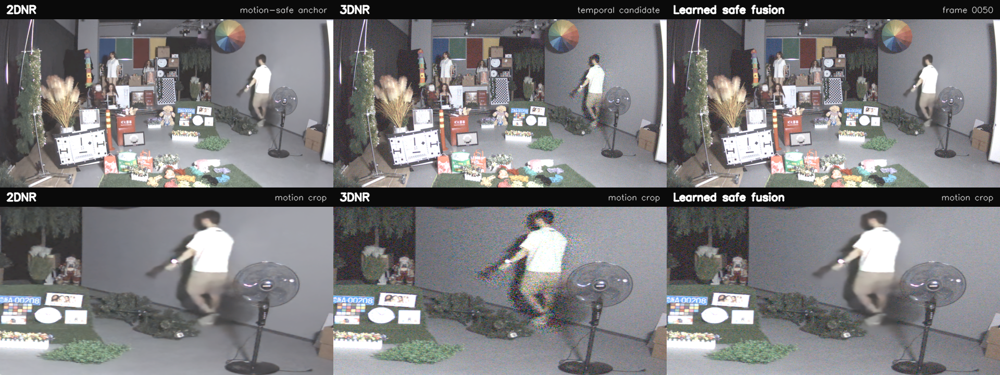
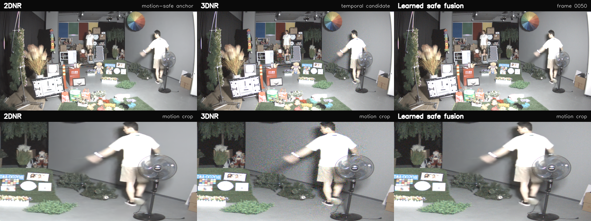

# 公司数据融合结果（2026-08-18）

## 1. 交付内容

| 类型 | 文件 |
|---|---|
| 原始附件 | `docs/hty8.17_original.md` |
| 修订方案 | `docs/方案说明_修订版_20260818.md` |
| 最终模型 | `outputs/checkpoints/joint_v2/best.pt` |
| 645x 融合 RAW | `outputs/raw/645x_learned_fusion.raw` |
| 128x 融合 RAW | `outputs/raw/128x_learned_fusion.raw` |
| 645x 对比视频 | `outputs/videos/645x_comparison.mp4` |
| 128x 对比视频 | `outputs/videos/128x_comparison.mp4` |
| 门控稳定性 | `outputs/metrics/645x_stability.json`、`outputs/metrics/128x_stability.json` |

视频每段 200 帧、20 fps、1920x720：上排是整帧 2DNR/3DNR/最终融合，下排是人物运动区域 crop。显示只经过统一的确定性 WB、黑电平和曝光，不参与模型推理。

## 2. 训练记录

- 数据：`645x`、`128x`，每组 200 帧，1920x1080 RGGB。
- 训练方式：两场景联合、时间留出验证；训练帧 8-135，验证帧 144-175，中间保留 8 帧间隔带。
- 训练：6 epochs、120 steps/epoch、128 packed patch、batch 10。
- 最佳 epoch：第 4 epoch，选择分数 `0.0527177057`。
- 训练时间：约 177.4 秒；设备 `NVIDIA GeForce RTX 5060 Laptop GPU`。
- 训练 target 是安全规则生成的 gate pseudo-label，不是 clean 图像监督。

## 3. 最终指标

### 3.1 安全和候选偏差

| 场景 | 静态时序 MAE 2DNR (DN) | 静态时序 MAE 3DNR (DN) | 静态时序 MAE 融合 (DN) | 硬运动像素 | 融合偏离 2DNR (DN) | 精确回退比例 | 静态高置信平均 gate |
|---|---:|---:|---:|---:|---:|---:|---:|
| 645x | 0.5752 | 0.6937 | **0.5359** | 7,497,571 | 0 | **1.0000** | 0.8193 |
| 128x | 1.8942 | 1.6597 | **1.3343** | 7,846,760 | 0 | **1.0000** | 0.8107 |

静态高置信区中，融合到 3DNR 的平均偏差为 1.4817 DN（645x）和 4.8526 DN（128x）；到 2DNR 的平均偏差为 4.8115 DN 和 12.7889 DN。说明静态区主要使用 3DNR，运动区不让 3DNR 进入输出。

### 3.2 门控稳定性

稳定性脚本在相邻帧共同满足 `confidence >= 0.8`、排除硬风险并做 5x5 packed 腐蚀的持久静态区统计 gate 绝对差：

| 场景 | 像素对数 | 均值 | P95 | P99 | 最大值 |
|---|---:|---:|---:|---:|---:|
| 645x | 80,068,168 | 0.00697 | 0.03529 | 0.05882 | 0.91765 |
| 128x | 81,217,615 | 0.00715 | 0.03529 | 0.05490 | 0.93725 |

最大值集中在风险边界/进入或离开硬回退的帧，不能用最大值单独代表静态闪烁；P95/P99 和视频复核更适合作为回归指标。

### 3.3 方法学限制

本数据集没有 clean reference，故没有报告 PSNR、SSIM、真实噪声方差改善或“视觉质量提升百分比”。上表只回答两个可验证问题：

1. 高风险运动区是否严格回到可接受的 2DNR 锚点？本次为是，逐 DN 精确比例 1.0。
2. 非风险区是否能接近 3DNR 且比逐帧 gate 更稳定？本次两组序列均满足诊断指标和视频观察，但仍属于内部 feasibility 结果。

## 4. 视频检查

接触图中人物运动 crop 的最终融合与 2DNR 保持一致，3DNR 的运动区域可见颗粒/拖影没有被直接带入。静态背景中最终融合接近 3DNR。完整视频位于 `outputs/videos/`，并配有同名 JSON 元数据。

## 5. 第一版实验与修订原因

第一版留一场景模型虽然满足 645x 的硬回退，但 128x 出现明显域偏移：静态时序 MAE 融合达到 8.9224 DN，且归一化后反变换无法覆盖候选黑电平以下的 2DNR 值。该版本没有作为最终输出，仅保留其训练/推理代码和指标作为审计线索。最终版本通过联合训练、阈值归一化、原生 DN 融合和因果迟滞修复了这两个问题。

## 6. 文件完整性

最终 RAW 和视频的 SHA-256 在 `outputs/MANIFEST.md` 中记录。重新生成任何文件后应更新清单并重新执行单元测试、`evaluate`、`stability` 和视频可读性检查。
