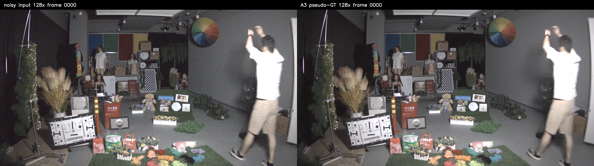
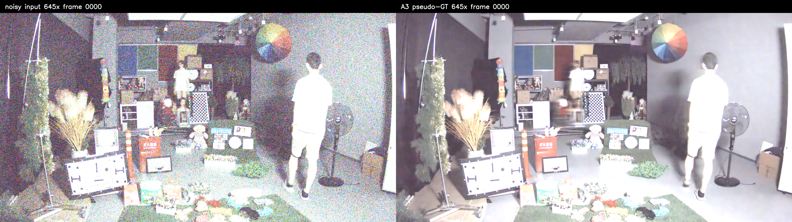

# RViDeformer 去噪微调方案简述

日期：2026-09-24

## 一、我们遇到的问题
我们要训练一个去噪模型，但是公司给我们的数据太少了，既想要去掉噪声，还想要保留高频细节，这点数据规模感觉够呛，于是我选择直接拿一个训练好的有很好去噪效果的模型在我们的数据集上进行一波精准微调。

我选择的 RViDeformer 是在 CRVD 数据集上训练的。它可以去除一部分噪声，但直接拿到公司采集的 RAW 视频上使用时，会把真实的高频细节一起抹掉，例如图卡细线、棋盘纹理和文字边缘变得平滑。

## 二、准备怎么解决

整体思路是：

1. **先找到接近干净的参考图。**
   在 MIS20S1 暗房中，同一个场景被用多个增益（相机对传感器信号的放大倍数，近似理解为ISO）重复拍摄。低增益画面噪声较小，我们把同一流中的 100～200 帧做时域平均，得到一张稳定的参考图。实测表明，平均后的残差噪声约小于 1 DN（Digital Number，像素数值），而且图卡细节仍然存在，因此它更适合作为监督目标。

2. **用真实测量建立噪声模型。**
   有了干净数据，公司也给了原始数据(noise)，但是为了训练出来的模型有更好的鲁棒性，我打算自制一些噪声数据，刚好公司也给了盖住镜头拍摄的黑帧，直接用算法添加不同程度的噪声到干净图上。但是合成的数据必须和真实视频的噪声统计接近，否则不会用于正式训练。如果和真实视频的噪声统计偏差很大的话，推理阶段可能把一些没见过的细节当噪声抹掉。
   所以我们使用标定数据测量不同亮度和增益下的噪声变化，并补充场景级验证。通过这个模型，从干净参考图合成不同强度的 RAW 噪声数据，扩大训练覆盖范围。

3. **使用真实数据和合成数据一起训练。**
   真实数据提供真实传感器和真实运动场景，合成数据提供更多噪声强度和亮度组合。训练时只在静态、未饱和区域计算损失，避免运动物体和过曝区域把错误监督带进模型。

   为什么会代入错误监督？因为我们的干净参考图是通过多帧平均得到的。如果画面里有人、风扇或树叶在移动，同一个像素位置在不同帧中可能对应不同内容。如果把这个平均结果当作目标，模型就会被要求把输入中的人变成“半透明的平均影子”。这不是正确的去噪目标，而是错误的内容监督，容易导致拖影、模糊或运动区域异常。过曝时，传感器已经达到上限，像素被截断成接近同一个最大值。原本不同的细节可能都变成一片白。模型无法从这个输入中判断原来的细节。如果目标图中数值略有不同，损失函数却会强行要求模型恢复这些无法观察到的信息；如果输入和目标的曝光程度不同，还会产生很大的错误像素差异。模型可能因此学到错误的亮度或边缘处理方式。

   如何做？运动区域通过运动mask排除，过曝区域通过饱和 mask 排除。运动mask不必多说了，饱和mask根据 RAW 像素是否接近传感器上限来判断。

## 三、模型训练方式

模型使用官方 RViDeformer-L_CRVD 预训练权重作为起点，进行小学习率的全参数微调，不从零开始训练。

- 输入：高增益 RAW 视频的连续 6～8 帧；
- 目标：低增益多帧平均得到的干净参考，或对应的合成数据中的干净图；
- 数据格式：按每个传感器实际测得的位对齐、黑电平和 CFA 排列处理；
- 初始数据比例：真实跨增益配对和合成配对约为 1:1；
- 损失函数：以像素重建误差为主，同时加入梯度损失，重点约束边缘和高频细节；必要时再加入频域损失；
- 训练策略：先用约 200 步确认数据和损失都正常，再进行数千到万步级长训，根据验证结果早停，而不是固定追求步数；
- 训练保存：保留 EMA 权重和每个阶段的配置、数据清单及验证记录，保证结果可复现。

## 四、如何判断是否有效

采用“留一个增益不参加训练”的验证方式，检查模型能否在未见过的噪声强度上工作。主要看四类结果：

- 噪声是否明显下降，平坦区域残差是否控制在约 2 DN 以内；
- 图卡、棋盘和文字等高频细节是否保留，不能出现明显过度平滑或光晕；
- 输出视频的帧间变化是否稳定，不产生新的闪烁；
- 输出是否符合 RAW 的数值范围和黑电平约定。

## 五、后续扩展

第一阶段只做 MIS20S1 的完整闭环，先确认过平滑问题确实得到改善。验证通过后，再加入其他传感器和场景进行混合训练，并保留 MIS20S1 数据防止模型遗忘。

## 效果图

### MIS20S1 128x

### MIS20S1 645x

